# 🛍️ S-Store Admin Panel Dashboard

<p align="center">
  
  
  
  
  
</p>

A modern, responsive, and feature-packed **eCommerce Admin Panel & Dashboard** built with **Flutter Web & Desktop** and powered by **Supabase**. Designed as the administrative command center for the **S-Store** mobile application.

---

## 📸 Screenshots Showcase

> [!NOTE]
> Detailed walkthrough of the administrative interface across key modules.

| 🔐 Login & Authentication | 📊 Analytics & Dashboard |
| :---: | :---: |
| 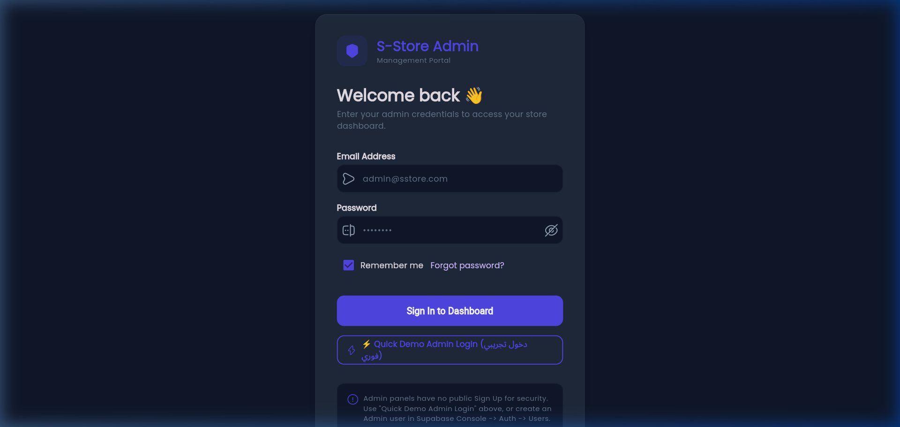 | 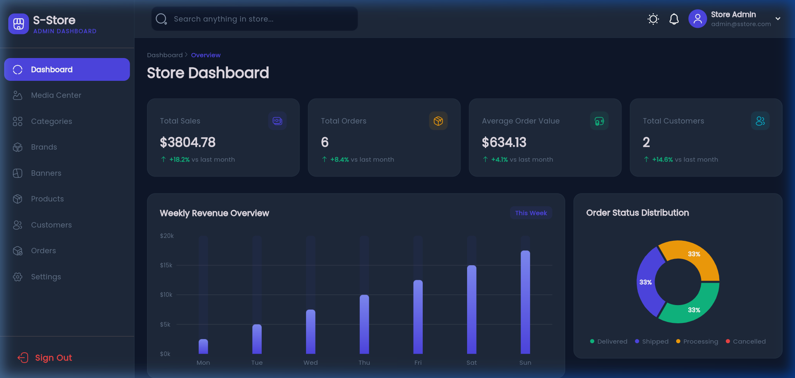 |
| *Secure Supabase authentication & session handling* | *Real-time metrics, revenue charts & recent orders* |

| 📦 Products Management | ➕ Create & Edit Product |
| :---: | :---: |
| 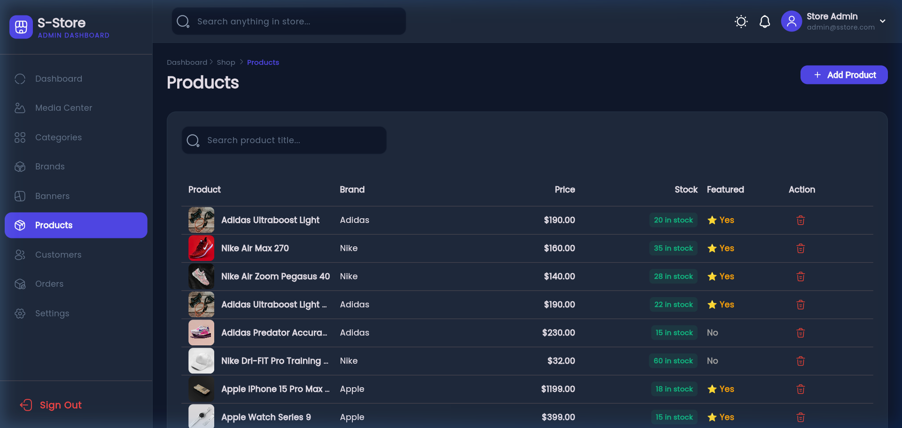 | 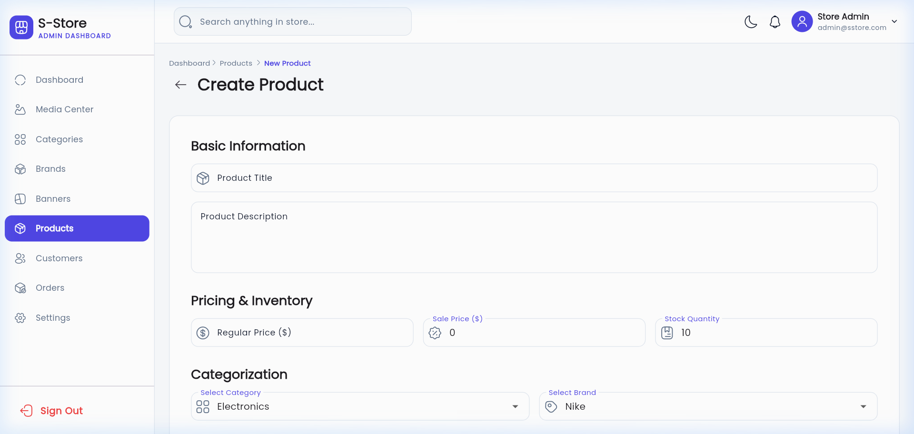 |
| *Paginated Data Table with search, filter & stock status* | *Full product builder with variants, images & pricing* |

| 🏷️ Categories Management | 🏢 Brands Management |
| :---: | :---: |
| 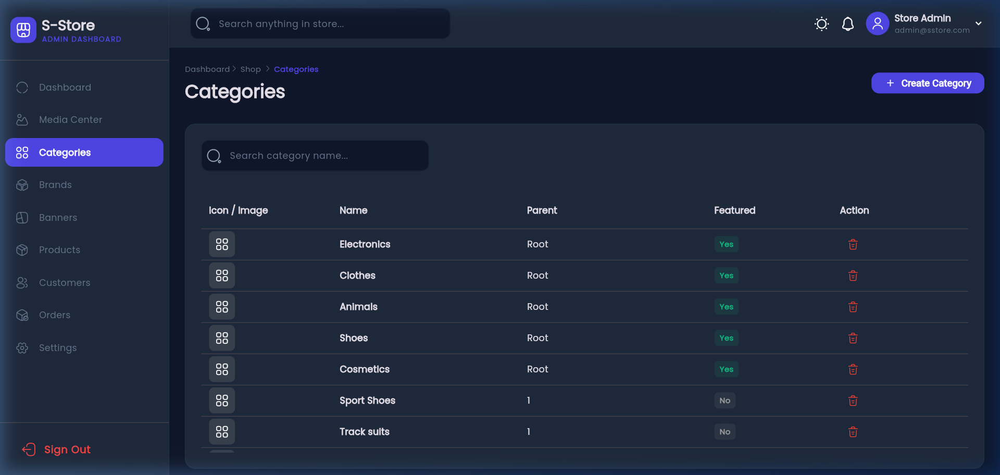 | 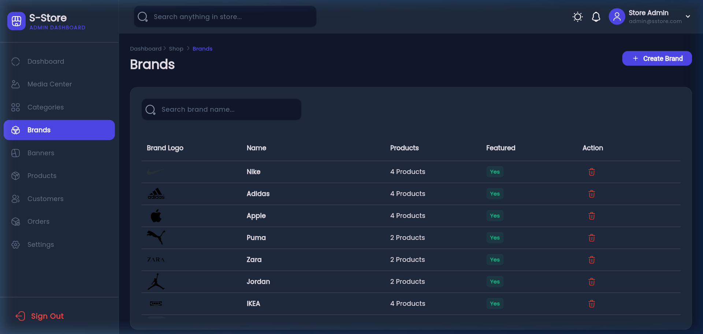 |
| *Hierarchical categories & featured toggles* | *Brand icons, category linking & status* |

| 🎯 Promotional Banners | 📋 Orders Management |
| :---: | :---: |
| 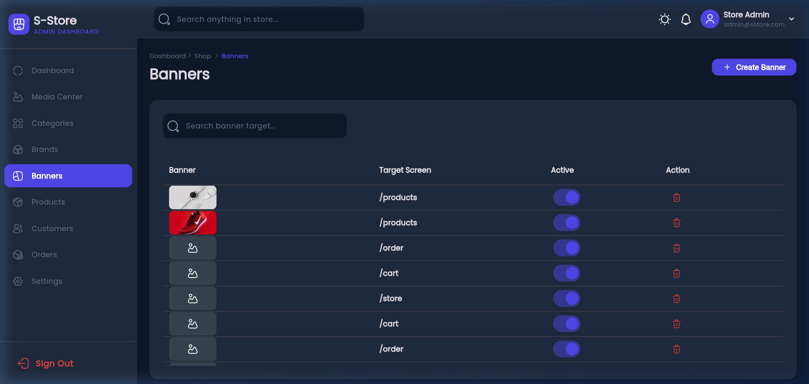 | 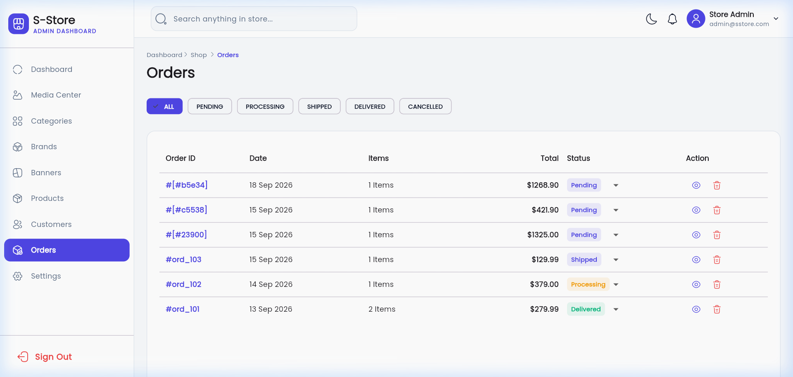 |
| *Slider banners & targeted screen redirects* | *Order lifecycle, status updates & customer records* |

| 👥 Customers Directory | 🖼️ Media & Cloud Storage |
| :---: | :---: |
| 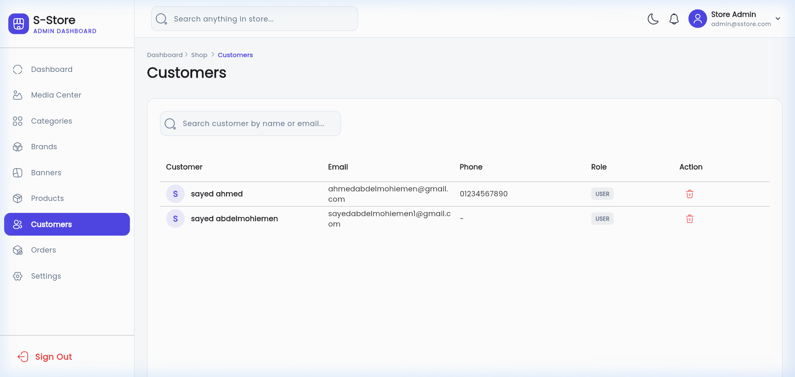 | 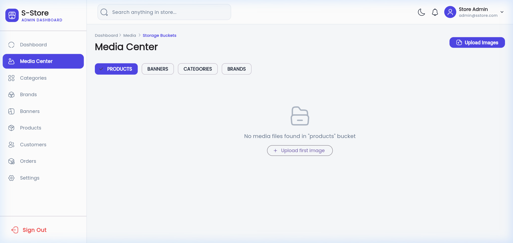 |
| *User profiles, order history & account states* | *Supabase Storage asset manager & image picker* |

| ⚙️ Store Settings |
| :---: |
| 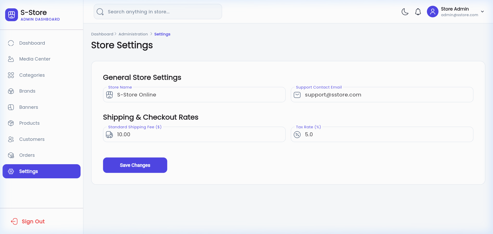 |
| *Store configurations, policies & theme preferences* |

---

## ✨ Features

- **📊 Comprehensive Analytics Dashboard:**
  - Real-time revenue, order count, customer growth, and conversion rate metrics.
  - Interactive charts powered by `fl_chart`.
  - Quick glance at recent orders and low-stock alerts.

- **📦 Advanced Product Catalog Management:**
  - Full CRUD operations on single & multi-variant products.
  - Attribute matrices (Colors, Sizes, Custom attributes).
  - Stock level indicators and instant search/filtering.

- **🏷️ Categories & Brands Hierarchy:**
  - Nested category relationships.
  - Linked brands to categories with direct Supabase relational queries.

- **🎯 Marketing & Sliders:**
  - Dynamic home banners configuration.
  - Direct routing association for mobile app promotional banners.

- **📑 Order & Customer Processing:**
  - Real-time order status management (Pending, Processing, Shipped, Delivered, Cancelled).
  - Customer directory with lifetime purchase tracking.

- **🖼️ Built-in Media Center:**
  - Centralized image upload and management backed by **Supabase Storage**.
  - Reusable image selector across products, categories, and banners.

- **🔒 Enterprise Security & Roles:**
  - Secure authentication middleware (`SRouteMiddleware`).
  - Route guards preventing unauthorized dashboard access.

---

## 🛠️ Tech Stack & Architecture

- **Framework:** [Flutter](https://flutter.dev/) (Web & Desktop)
- **Language:** [Dart](https://dart.dev/)
- **Backend-as-a-Service:** [Supabase](https://supabase.com/) (PostgreSQL, Auth, Storage, Realtime)
- **State Management & Routing:** [GetX](https://pub.dev/packages/get)
- **Data Visualizations:** [fl_chart](https://pub.dev/packages/fl_chart)
- **Responsive Tables:** [data_table_2](https://pub.dev/packages/data_table_2)
- **Local Cache:** [get_storage](https://pub.dev/packages/get_storage)
- **Icons & Typography:** [Iconsax](https://pub.dev/packages/iconsax) & [Google Fonts](https://pub.dev/packages/google_fonts)

```
lib/
├── app.dart                       # App initialization & GetMaterialApp
├── main.dart                      # App entry point & Supabase config
├── common/                        # Reusable global widgets & layouts
│   └── widgets/                   # Sidebars, headers, loaders, breadcrumbs
├── data/                          # Data layer (repositories & models)
│   └── repositories/              # Supabase data access objects
├── features/                      # Modular feature-driven architecture
│   ├── authentication/            # Auth screens & controllers
│   ├── media/                     # Cloud media manager
│   └── shop/                      # Core eCommerce administration
│       ├── banners/
│       ├── brands/
│       ├── categories/
│       ├── customers/
│       ├── dashboard/
│       ├── orders/
│       ├── products/
│       └── settings/
├── routes/                        # Named routes & auth guards
└── utils/                         # Theme, constants, helpers & validators
```

---

## 🚀 Getting Started

### Prerequisites
- Flutter SDK (v3.10.8 or higher)
- Chrome / Edge (for Web) or Visual Studio C++ Build Tools (for Windows Desktop)

### 1. Clone & Install Dependencies
```bash
git clone https://github.com/AlsayedAbdelmohiemen/s-store-Admin-Panel.git
cd s-store-Admin-Panel
flutter pub get
```

### 2. Configure Supabase Credentials
For security, credentials are kept out of version control. Copy the configuration template:
```bash
cp lib/config/supabase_config.example.dart lib/config/supabase_config.dart
```
Then open `lib/config/supabase_config.dart` and fill in your Supabase project credentials:
```dart
class SupabaseConfig {
  static const String url = 'YOUR_SUPABASE_PROJECT_URL';
  static const String publishableKey = 'YOUR_SUPABASE_ANON_KEY';
}
```

### 3. Run the Application
For Web (recommended):
```bash
flutter run -d chrome
```

For Windows Desktop:
```bash
flutter run -d windows
```

---

## 🔗 Related Repositories

- **Mobile Application:** [S-Store Mobile App (Flutter & Supabase)](https://github.com/AlsayedAbdelmohiemen/s_store)

---

## 📄 License
This project is proprietary and intended for internal operations of the S-Store platform.
